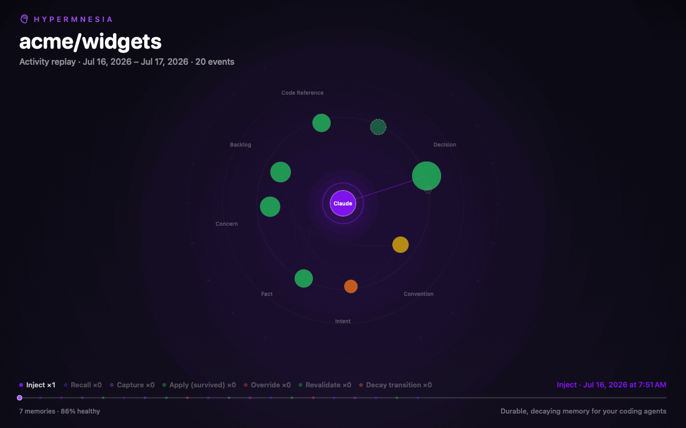
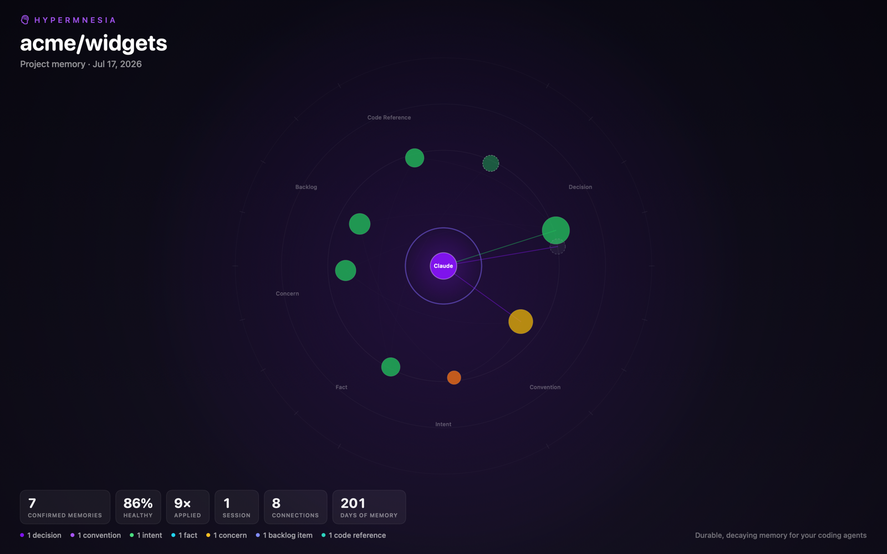

# Hypermnesia

> **hypermnesia** *(n.)* — unusually vivid or complete memory; abnormally sharp recall
> of the past.

**[hypermnesia.app](https://hypermnesia.app)**

A **local-first** memory system that gives **Claude Code** (and **Cursor**, and **Google
Antigravity**) a durable, decaying, queryable memory of every project it works on. Editor hooks
capture each session as it happens; an LLM classifies the transcript into typed memories; memories
age and decay unless they stay useful; and the relevant ones are injected back into future sessions
— so the agent remembers *why* the codebase is the way it is. ([Using with
Cursor](#using-with-cursor) and [with Antigravity](#using-with-google-antigravity) each take two
commands.)

<p align="center">
  
</p>
<p align="center"><sub>The live MRI view, exported as a replay — every pulse is a real event from a
coding session, replayed with its wall-clock timestamp (rendered here from sample data).</sub></p>

**Measured, honestly:** on eval tasks where a project convention exists *only* in memory, a
memoryless agent solved 3/24 while the same agent with automatic hydration solved 15/24 — and
0/12 → 12/12 on the subset whose memory states the requirement explicitly, matching the paste-it-
into-the-prompt oracle. Injected memory broke 1 of 18 adversarial control tasks (baseline 18/18).
Small n, synthetic tasks, one subject model; the full harness, data, and the cases where memory
*hurt* are committed in [`evals/`](evals/RESULTS.md).

It's a general re-implementation of a "Project Memory" system the author originally built inside an
earlier (private) app — same concept, but on-device and driven by Claude Code instead of a hosted
runtime.

---

## How it works

```
 Claude Code session          (Cursor and Antigravity: analogous hooks, same pipeline)
   SessionStart / UserPromptSubmit ──hydrate──►  inject relevant memories into context
   Stop / SessionEnd ──capture──►  queue the transcript
                                        │
                                        ▼ (drained by the app or a hook-spawned CLI)
   transcript ─► condense ─► classify (Gemini / Claude) ─► dedup ─► typed memories ─► decay
```

- **Capture** — incremental, *during* the session: a `Stop` hook checkpoints a per-session cursor and
  only the new slice of the transcript is classified once a few exchanges accumulate.
- **Classify** — a pluggable adapter (default **Gemini 3.5 Flash**, fallback `claude -p`) extracts
  typed memories: `decision`, `convention`, `intent`, `fact`, `concern`, `backlog`, `codeRef`.
- **Curate** — confident captures go live on their own; revisions, weak captures, and agent
  `remember` writes wait as drafts for your confirm/dismiss. Near-duplicates are merged (Jaccard),
  and a newer memory that contradicts an older one retires it automatically.
- **Decay** — memories lose confidence as they age (Fresh → Aging → Stale → Dormant) unless
  revalidated by use; a Health view shows what needs review.
- **Hydrate** — relevant confirmed memories are injected into new sessions via hook context, and
  per-prompt by relevance.

The macOS app surfaces a capture inbox, a browser with full-text search, a Health view, a
force-directed memory **graph**, **Trends** charts (capture rate, confidence, decay over time), a
live **MRI** view that animates real memory activity as it happens, and an **Ask** panel for
natural-language questions over your memories. The `hypermnesia` CLI does the headless work the
hooks call — and can list, show, export, and delete memories without the app.

<p align="center">
  
</p>
<p align="center"><sub>Everything exports: snapshot cards in four social sizes (copy, share sheet,
or save), the replay GIF above, and a committable <code>MEMORY.md</code> digest of the project's
memory. Cards carry corpus stats only — never memory content.</sub></p>

## Install

**[Download for macOS](https://github.com/tweibley/hypermnesia/releases/latest/download/Hypermnesia.zip)**
(universal, signed & notarized) — unzip, drag to Applications, open; the app walks you through
setup and ships its CLI inside the bundle. Or with Homebrew, which also puts `hypermnesia` on
your `PATH`:

```bash
brew install --cask tweibley/tap/hypermnesia
open -a Hypermnesia
```

Then jump to `hypermnesia setup` below. (Cask setup for maintainers:
[`packaging/homebrew/`](packaging/homebrew/README.md).)

## Build from source

Requires macOS 14+, a Swift 6 toolchain (developed with Swift 6.2 / Xcode 26), and `claude` on
`PATH`.

```bash
# Build the app + CLI (run `swift test` to check the suite)
bash Scripts/make-app.sh            # → Hypermnesia.app
swift build                          # → .build/debug/hypermnesia
mkdir -p ~/.local/bin
ln -sf "$PWD/.build/debug/hypermnesia" ~/.local/bin/hypermnesia   # ensure ~/.local/bin is on PATH

# Try it without waiting for live sessions: backfill a repo's past sessions
# (Claude Code by default; add --client cursor or --client antigravity for the others)
hypermnesia backfill --project ~/some/repo --dry-run   # preview
hypermnesia backfill --project ~/some/repo             # run

open Hypermnesia.app

# Turn on automatic capture + injection for new sessions (one command)
hypermnesia setup                    # hooks, all projects (or --project <path>)
hypermnesia setup --with-mcp         # …plus the MCP pull path (recall/ask/remember)
```

`setup` wraps the individual installers (`install-hooks`, `install-memory-guide`, `allow-tools`,
`install-mcp`) — each remains available for finer control, and `setup --uninstall` reverses
everything. `hypermnesia doctor` verifies the result.

### Using with Cursor

Cursor is a first-class second client — the same local memory, captured from and injected into Cursor
agent sessions, with `recall`/`ask`/`remember` available to its agent. Two one-shot installers (or the
app's **Settings → Cursor** tab) wire it up:

```bash
hypermnesia install-cursor-mcp     # register the server in ~/.cursor/mcp.json (recall/ask/remember)
hypermnesia install-cursor-hooks   # capture + inject via ~/.cursor/hooks.json
```

`install-cursor-hooks` adds a `sessionStart` hook (inject memory) and `stop`/`sessionEnd` hooks
(capture → drain). Cursor approves MCP tools in its own UI the first time; hydration is session-start
only (Cursor has no per-prompt context hook). Seed memory from past Cursor work with
`hypermnesia backfill --project ~/some/repo --client cursor`. Both installers take `--project P`
(writes `<P>/.cursor/…`), `--uninstall`, and `--dry-run`.

### Using with Google Antigravity

[Google Antigravity](https://antigravity.google) is a third client — same local memory, captured
from and injected into Antigravity conversations (app, IDE, and CLI variants), with
`recall`/`ask`/`remember` available to its agent. Two one-shot installers (or the app's
**Settings → Antigravity** tab) wire it up:

```bash
hypermnesia install-antigravity-mcp     # register the server in ~/.gemini/config/mcp_config.json
hypermnesia install-antigravity-hooks   # capture + inject via ~/.gemini/config/hooks.json
```

`install-antigravity-hooks` registers a `hypermnesia` hook with a `PreInvocation` handler (inject
memory — only the first invocation of a fresh conversation hydrates, so nothing re-injects
mid-session) and a `Stop` handler (capture → drain; it never blocks the agent from stopping).
Hydration is conversation-start only (Antigravity has no per-prompt context hook). Seed memory from
past Antigravity work with `hypermnesia backfill --project ~/some/repo --client antigravity`
(`agy` works as a shorthand) — the workspace is recovered from each transcript's own tool calls.
Both installers take `--project P` (writes `<P>/.agents/…`), `--uninstall`, and `--dry-run`.

**Troubleshooting:** `hypermnesia doctor` reports install state for all clients. If captures aren't
landing, hooks emit one-line diagnostics to **stderr** naming any absent payload field (the common
case is Cursor not providing `transcript_path` — enable transcript export). Set `HYPERMNESIA_DEBUG=1`
to trace every hook run.

### Use from any other editor (MCP)

The memory is exposed as a [Model Context Protocol](https://modelcontextprotocol.io) server, so Claude
Desktop or any MCP client can `recall`, `ask`, and `remember`. Add to your client's MCP config:

```json
{ "mcpServers": { "hypermnesia": { "command": "hypermnesia", "args": ["mcp"] } } }
```

A `GEMINI_API_KEY` enables the (recommended) Gemini classifier; without one it falls back to
`claude -p`. Both are configurable in the app's **Settings** (⌘,).

## CLI

| Command | What it does |
|---|---|
| `setup [--project P] [--with-mcp] [--uninstall]` | One-shot setup (hooks; `--with-mcp` adds the pull path) |
| `list` / `show <id>` / `delete <id>` / `export` | Manage memories headlessly (`--json` for scripts) |
| `recall "<query>" [--project P]` | Print what MCP `recall` would inject (scriptable pull path) |
| `backfill --project P [--all] [--client claude\|cursor\|antigravity] [--dry-run]` | Replay past sessions into memories (backdated decay); `--all` works for every client |
| `classify <transcript> [--store]` | Classify a single transcript (dry-run or persist) |
| `ask "<question>" [--project P]` | Natural-language query over a project's memories |
| `audit [--project P] [--deep] [--apply]` | Flag memories whose files are missing/changed since capture |
| `mcp` | Run a Model Context Protocol server (stdio) for any MCP client |
| `hydrate` / `capture` `[--client claude\|cursor\|antigravity]` | Hook entry points (used by `install-*-hooks`) |
| `drain [--dry-run] [--limit N] [--classifier auto\|gemini\|claude]` | Classify queued captures (all clients share one queue) |
| `install-hooks` / `install-mcp` `[--project P] [--uninstall]` | Wire/unwire the Claude Code hooks / MCP server |
| `install-cursor-hooks` / `install-cursor-mcp` `[--project P] [--uninstall] [--dry-run]` | Wire/unwire the Cursor hooks / MCP server |
| `install-antigravity-hooks` / `install-antigravity-mcp` `[--project P] [--uninstall] [--dry-run]` | Wire/unwire the Google Antigravity hooks / MCP server |
| `inspect <transcript>` · `seed` · `doctor` | Debug / sample-data / environment helpers |

## Architecture

- **`HypermnesiaKit`** — platform-agnostic engine: models, GRDB + FTS5 store, capture pipeline,
  classifier adapters, decay, dedup, hydration, graph layout/inference, NL query, config.
- **`hypermnesia`** — the headless CLI the hooks invoke.
- **`HypermnesiaApp`** — the SwiftUI macOS menu-bar + window app.

Everything is stored locally in `~/Library/Application Support/Hypermnesia/memory.db`. There is
no telemetry. The only data that leaves your machine goes to the classifier/completer you configure
(Gemini via your API key, or `claude -p`): transcript text for classification, and stored memory
summaries plus your question for `ask` and `audit --deep`. Because memories are injected into
future agent sessions, the ones needing judgment (revisions, weak captures, agent `remember`
writes) land as **drafts** you confirm in the app first; confident captures auto-confirm by
default (Settings → Capture to opt out) — see [SECURITY.md](SECURITY.md) for the threat model.

See [`docs/IMPLEMENTATION-PLAN.md`](docs/IMPLEMENTATION-PLAN.md) for the architecture and decisions,
and [`docs/PACKAGING.md`](docs/PACKAGING.md) for signing/notarization.

## Status

Feature-complete: capture ↔ hydrate loop, decay, dedup, backfill, graph, search, NL query, settings,
Claude Code + Cursor + Google Antigravity integration, and release packaging — all local. Run the
suite with `swift test`.

## FAQ

**Why not just CLAUDE.md?**
Hypermnesia *writes* your CLAUDE.md — `hypermnesia export --markdown` (or the app's "Export
memory digest") renders a project's confirmed memory as a committable `MEMORY.md`, sections,
provenance, and all. The difference is everything around that file: memories decay unless they keep
proving useful, carry applied/overridden evidence counters, are retired by newer contradicting
captures, and are injected by relevance (confidence-gated) instead of as one ever-growing preamble.
A hand-tended CLAUDE.md goes stale silently; here staleness is a first-class, visible state.

**Isn't this just RAG?**
The retrieval part is deliberately boring (FTS5 + embeddings). The interesting parts sit around it:
capture is automatic from real sessions; memories are typed (`decision`, `convention`, …, each with
structure like "does NOT apply to"); contradictions are detected at capture time; and decay +
belief decide whether a memory is still *trustworthy*, not just similar. The evals benchmark
against a paste-the-fact-into-the-prompt oracle — on tasks whose memory states the requirement
explicitly, hydration matched it (12/12).

**What leaves my machine?**
The store is local SQLite; no telemetry, no accounts. Exactly two things go to the
classifier/completer you configure (Gemini via your key, or `claude -p`): transcript slices for
classification, and stored memory summaries plus your question for `ask` / `audit --deep`. That's
the whole list — [SECURITY.md](SECURITY.md) has the threat model.

**Does injected memory ever hurt?**
Measured: yes, once — memory injection broke 1 of 18 adversarial control tasks that the baseline
passed (details, including the failure, in [`evals/`](evals/RESULTS.md)). The mitigations are
structural: overridden memories lose belief, stale ones fall below the injection floor until
revalidated, and risky writes land as drafts you confirm before they hydrate anything.

**Why macOS-only? Will there be a Linux build?**
The engine (`HypermnesiaKit`) and CLI are UI-free Swift over GRDB/SQLite — nothing in the
capture ↔ hydrate loop is macOS-specific; the SwiftUI app is. A headless Linux build of the CLI +
hooks is plausible; it just isn't built or tested yet. If that's what's blocking you, open an
issue.

**Does it slow sessions down or eat tokens?**
Hydration injects a small, bounded set: confirmed memories above a confidence floor at session
start, and up to 8 relevance-ranked ones per prompt. Capture is asynchronous — hooks checkpoint the
transcript and return; classification runs out-of-band (`drain`), so nothing blocks the session.
The only recurring spend is classification, on the model you choose.

## Troubleshooting

- **Start with `hypermnesia doctor`** — it reports toolchain, classifier, hook/MCP install state,
  and the memory count for both clients.
- **Captures queue up but no memories appear:** `hypermnesia drain --dry-run` shows what's queued;
  a failing classifier now reports itself (the app shows a banner, `drain` exits nonzero). The usual
  cause is a missing/invalid `GEMINI_API_KEY` — set it, or switch the classifier in
  **Settings → Classifier**.
- **Hooks seem to do nothing:** they're silent by design. Set `HYPERMNESIA_DEBUG=1` to trace every
  hook run to stderr; `HYPERMNESIA_DISABLE=1` turns Hypermnesia off for a session.
- **`recall` isn't available to the agent:** the MCP server isn't registered — run
  `hypermnesia install-mcp` (or `setup --with-mcp`).
- **Cursor captures nothing:** enable transcript export in Cursor so hooks receive a
  `transcript_path` (see the Cursor section above).

## Uninstall

```bash
hypermnesia setup --uninstall        # hooks, memory guide, pre-approvals, MCP registration
hypermnesia install-cursor-hooks --uninstall && hypermnesia install-cursor-mcp --uninstall
rm ~/.local/bin/hypermnesia          # the CLI symlink
rm -rf Hypermnesia.app               # wherever you put the app
```

Your data stays until you delete it (export first with `hypermnesia export --all` if you want a
backup): `rm -rf ~/Library/Application\ Support/Hypermnesia/`.

## License

[MIT](LICENSE). Bundled dependencies are covered in
[THIRD-PARTY-LICENSES.md](THIRD-PARTY-LICENSES.md).
